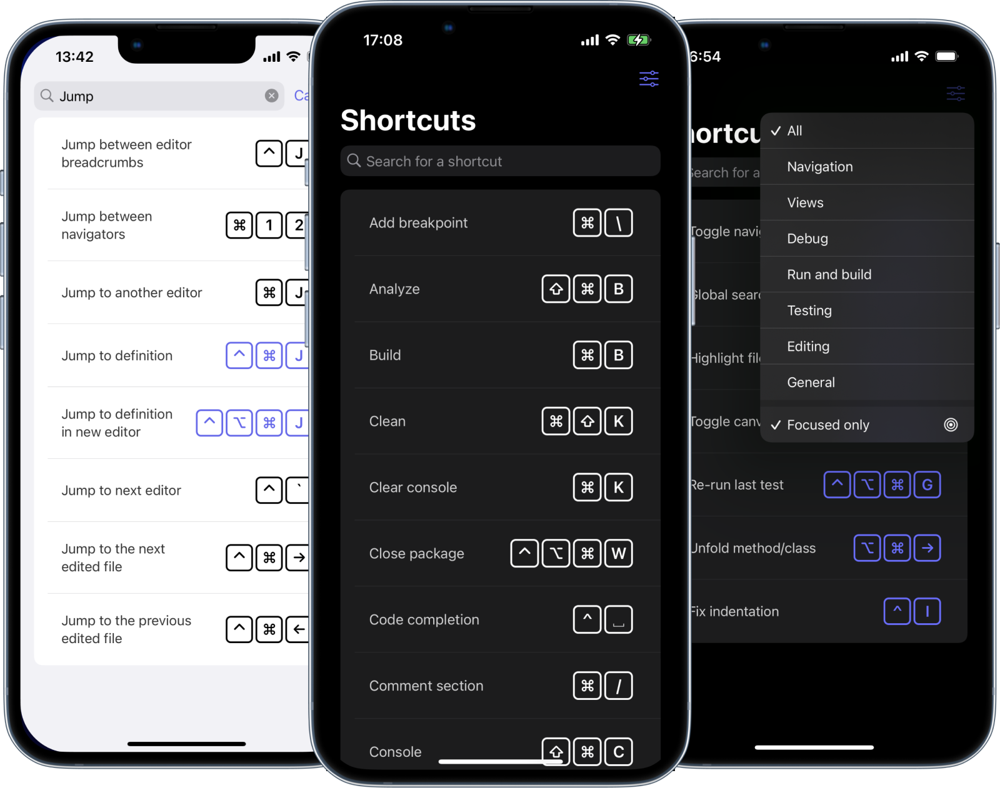

<h1 align="center">
   
  XShortcuts 
  

    
    
  

</h1>

Supercharge your Xcode development by learning shortcuts.

<a href="https://apps.apple.com/gb/app/xshortcuts/id1608921211">

  

</a>

 

  

 

## Features

XShortcuts is a simple developer tool to help you master Xcode shortcuts.

- Filters
- Searchable
- Focus the most useful shortcuts
- Light/dark mode support.
- Available on iOS and macOS

## License
XShortcuts is available under the Apache License 2.0 license. See the LICENSE.md file for more info.
